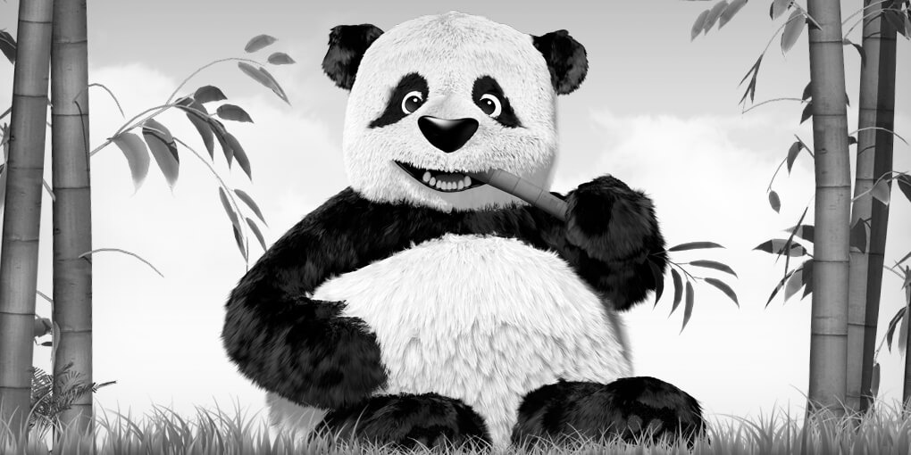
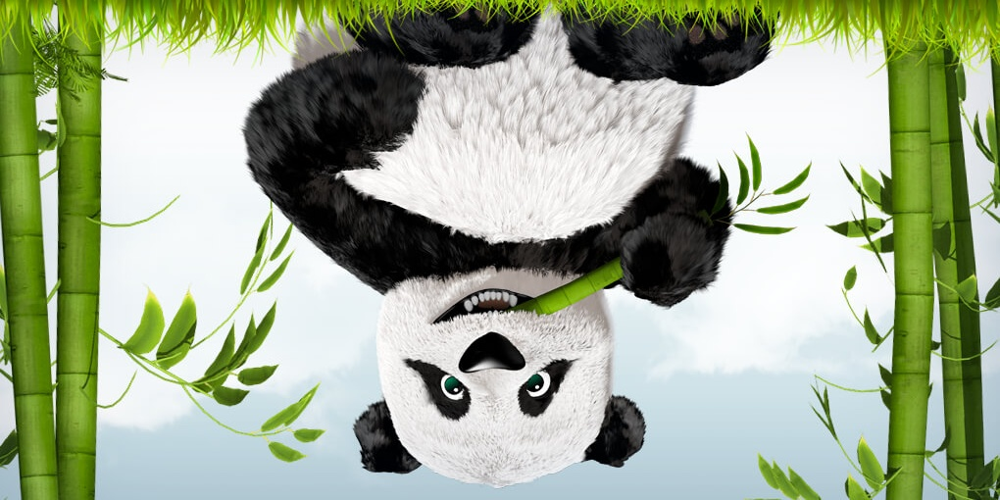
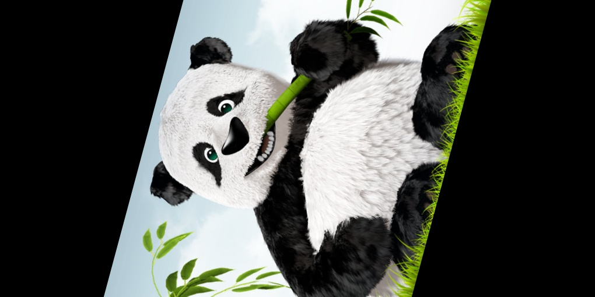
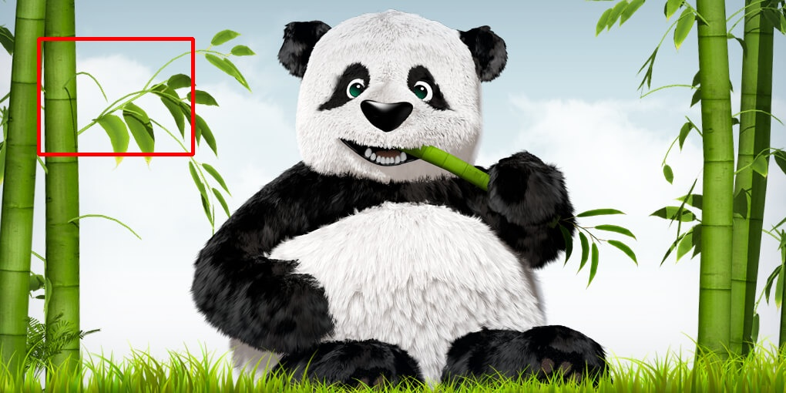

# OpenCV Python Fundamentals

Welcome to my OpenCV learning repository! This project serves as a structured documentation of my journey learning Computer Vision techniques using Python's `opencv-python` library. 

This repository contains heavily-commented, beginner-friendly scripts covering image operations — from basic I/O to advanced image manipulations and geometric transformations.

## 🚀 Quick Start

Ensure you have Python installed, then install OpenCV:

```bash
pip install opencv-python numpy
```

To run any script, execute it with Python. For example:
```bash
python image_handling_basics/loading.py
```

## 📂 Project Structure & Features

### 1. Image Handling Basics
Scripts related to loading, showing, saving, extracting dimensions, and color space transformations.

- **`loading.py`**: Loads and displays an image from the file system.
- **`dimensions.py`**: Interacts with the NumPy array shape to print image height, width, and number of channels.
- **`saving.py`**: Modifies/loads an image and writes it back continuously to disk.
- **`colorconv.py`**: Transforms images standard BGR channels into Grayscale.

**Output (Grayscale Conversion):**


### 2. Image Resizing & Shaping
Transforming and moving arrays in space using matrix transformations and affine warps.

- **`cropped.py`**: Crops parts of an image using NumPY tensor slicing.
- **`flipped.py`**: Flips images along axes (Horizontally, Vertically, or Both) effortlessly.
- **`imresize.py`**: Resizes images to user-defined explicit pixel values.
- **`rotation.py`**: Rotates images mathematically using a 2D affine transformation over calculated mid-point pivots.

**Outputs:**




### 3. Image Drawing Functions
How to procedurally draw vector graphics on top of raster image backgrounds.

- **`circle.py`**: Draws circles with specific radius and thickness.
- **`line.py`**: Draws straight lines between designated (X,Y) coordinates.
- **`rectangle.py`**: Draws hollow and filled rectangles using bounding boxes.
- **`text.py`**: Overlays custom text onto images using various font faces.

**Output (Drawing Shapes):**


### 4. Video Functions
Scripts demonstrating how to interact with webcams and process video streams.

- **`using_cap.py`**: Captures and displays a live video feed from the default webcam.
- **`saving_vid.py`**: Reads live webcam frames and saves them to an `.avi` video file using `VideoWriter`.

---

## 🤝 Contribution Activity
This repository was set up as an open-source demonstration representing early-stage computer vision experiments. Feel free to copy, modify, and use these snippets!
